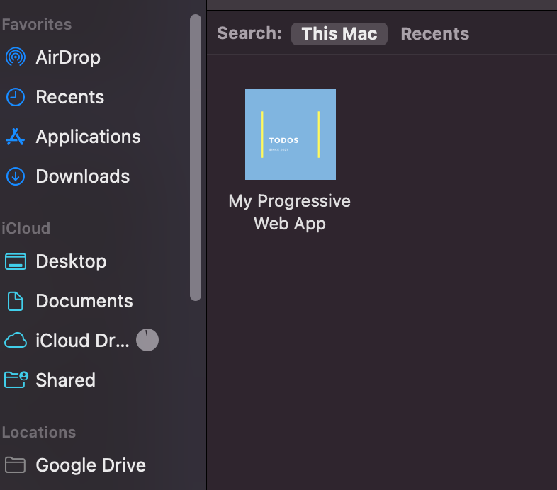
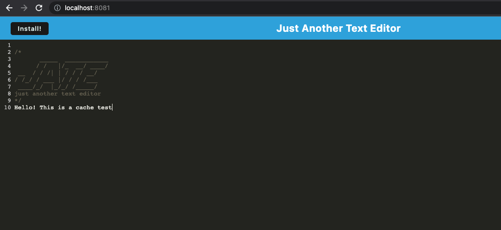

# Progressive Web Application: Text Editor

## Description

Deployed Heroku Application [here](https://serene-sierra-16900.herokuapp.com/)

Repository Link [here](https://github.com/princessjenn/Just-Another-Text-Editor.git)

This Progressive Web Application is built using the web technologies such as HTML, CSS, and JavaScript, making it compatible with multiple platforms and operating systems. It can run on various browsers, including Chrome, Firefox, Safari, and Edge to name a few! 

## Table of Contents

- [Installation](#installation)
- [Usage](#usage)
- [Contributing](#contributing)
- [Tests](#tests)
- [Questions](#questions)

## Installation

Here's how to get the PWA up and running:

1. Starting off with an existing application, this assignment challenged me to implement methods for getting and storing data to an IndexedDB database. We will use a package called `idb`, which is a lightweight wrapper around the IndexedDB API. It features a number of methods that are useful for storing and retrieving data

2. Set Up a Service Worker: This will act as a proxy between the web app and the network, allowing us to cache and serve content offline. We'll create a Service Worker JavaScript file and register it into the web app. The Service Worker will handle caching and offline functionality.

3. Implement Caching: Within the Service Worker, define which assets (HTML, CSS, JavaScript, images, etc.) should be cached for offline use. In our case, Javascript and CSS files, and we will use library Workbox for the the caching process.

4. Enable Offline Support: Add code to your Service Worker to intercept network requests and serve cached content when the user is offline. This way, your PWA can still function and display content even without an internet connection.

5. Make App Installable: Next, we can allow users to install our PWA on devices. We implemented a Web App Manifest file, which defines metadata such as the app name, icons, and theme. In this app there is an "Install" button which enables users to install the PWA on their device once clicked.

6. Deploying PWA: Once satisfied with the testing and debugging phase, I deployed my PWA to Heroku (linked at top of description in repo).

## Usage

Assuming logic is added to the `index.js` to register a service worker, and the `webpack.config.js` file is updated to use the HTML webpack plugin, AND the `Inject Manifest` class of the workbox webpack plugin, we can run and use the application through the viewport offline at `localhost:8080`

1. In VS Code, open the integrated terminal associated with the root of the directory

2. Assuming you have the programs and dependencies installed with `npm install`, simply type `npm run start:dev` into root directory terminal.

3. You will be presented with a console message in the terminal that the app is listening, and directs you to go to the viewport in your browser, `localhost:8080`

WITH online access, the deployed Heroku app can be viewed in your browser [here](https://serene-sierra-16900.herokuapp.com/)

## License 

This project is licensed under the terms of the MIT license.

## Contributing

To contribute to the project: 

1. start by forking the repository and creating a new branch specifically for your new feature or bug fix.
2. It's important to adhere to the project's coding standards and properly format your code.
3. When committing changes, be sure to write clear and concise messages that describe the changes made.
4. If your contribution affects the user interface or experience, include screenshots or animated GIFs in your pull request to help reviewers understand the changes. 
5. Additionally, make sure your code is thoroughly tested and all existing tests pass before submitting the pull request.
6. Finally, provide a detailed description of your changes and explain why they're necessary.

Thanks for contributing! 

## Tests

To ensure that my Text Editor Appliation was functioning properly, I used the command `npm run start:dev` in the root of the the app's directory to start running my application, ensuring the it was listening on the correct port and rendering properly in the browser port. This allowed me to ensure that my imports and exports were applied to the client side vs. server side properly. What is great about PWAs is the offline usage, so that I can see when the app is working before deploying by correctly caching and storing data, enabling me to access content and perform tasks even without an internet connection. That way I am able to catch any potential bugs or errors early on configuration, ensuring that my final product was functional.
 

## Questions

> Have any Questions? You can contact me on Github [here](https://https://github.com/princessjenn)

> Or, email me for more questions: j.eckenrode@me.com